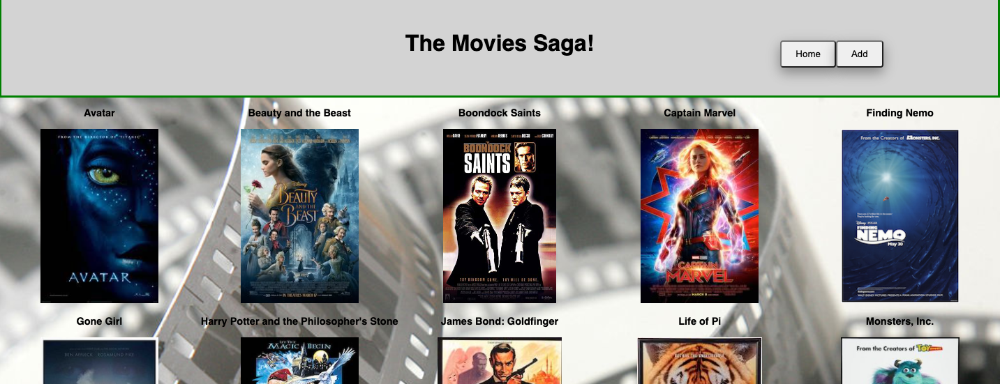
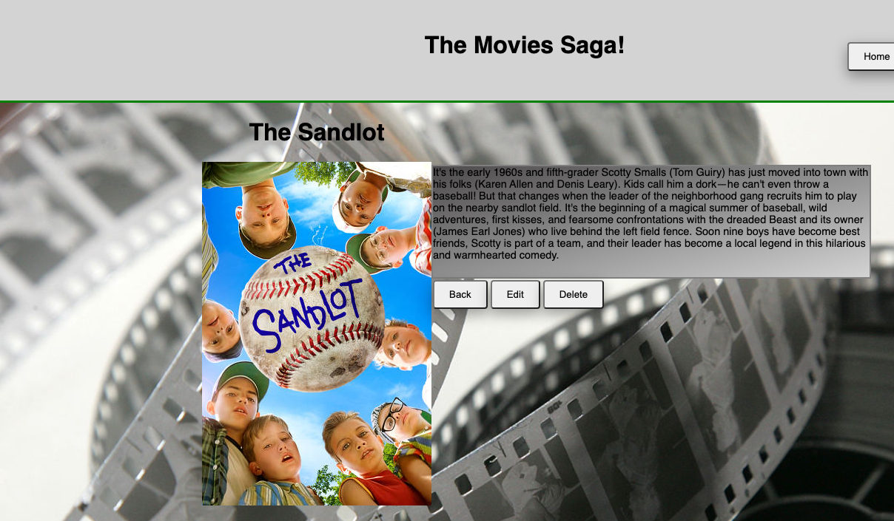

# React Sagas Movie Database

## Description

This project is a movie database that utilizes sagas to send and receive data from a Postgres data base. The data stored is the movie title, movie description, movie genre and all data is stored in the database in different tables. The data is obtained by executing axios calls to the server and routers. SQL is utilized to sort and filter data before returning to the application and storing the data in a REACT store for access throughout the applicaton. 

## Technology
- Javascript
- React
- Redux
- Postgres
- HTML
- CSS
- Express

Contents:
- Home page, Add page, Details Page
- Dispatch calls to reducers
- Redux store
- Postgres data storage, retrieval and deletion
- CSS to style
- Saga for data retrieval